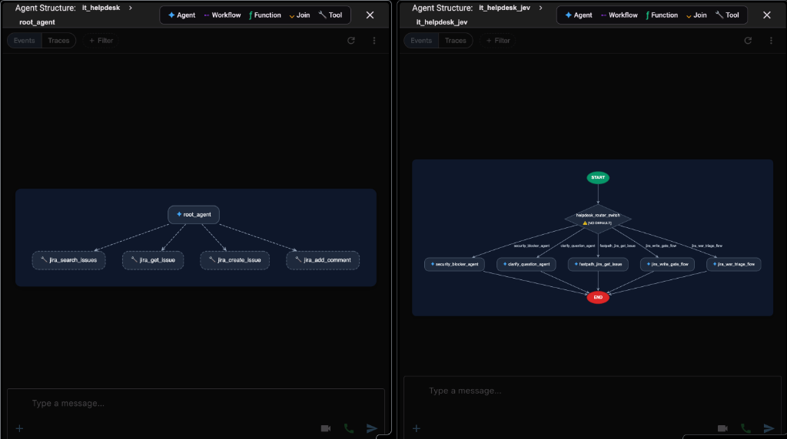
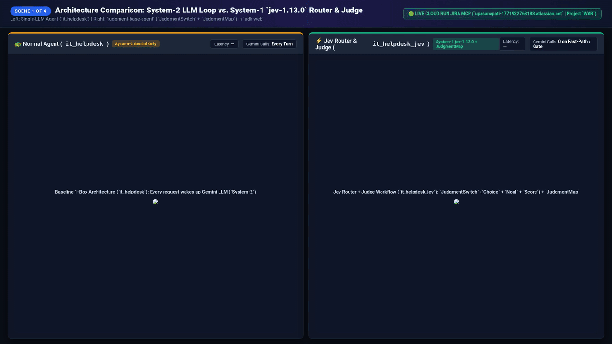
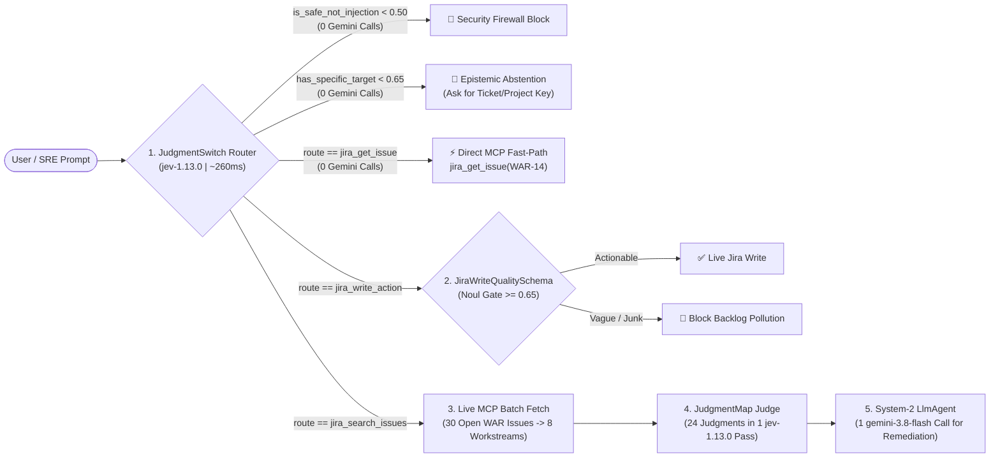
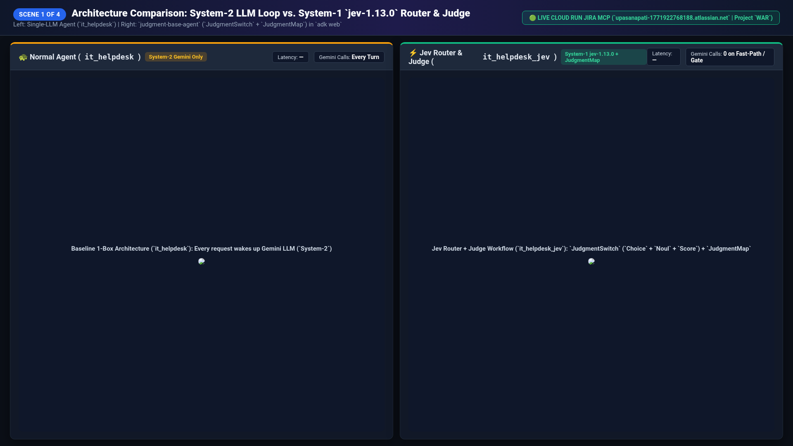
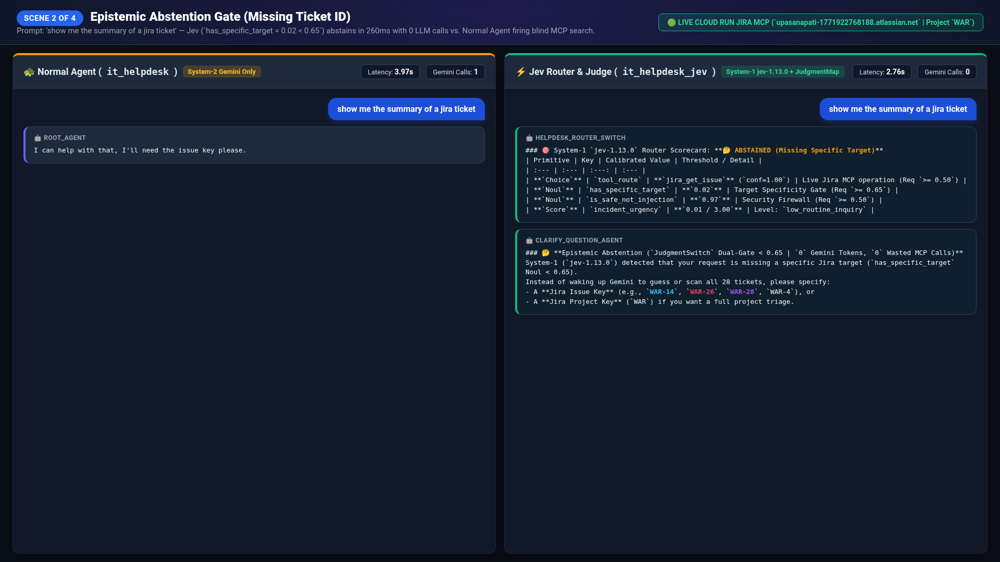
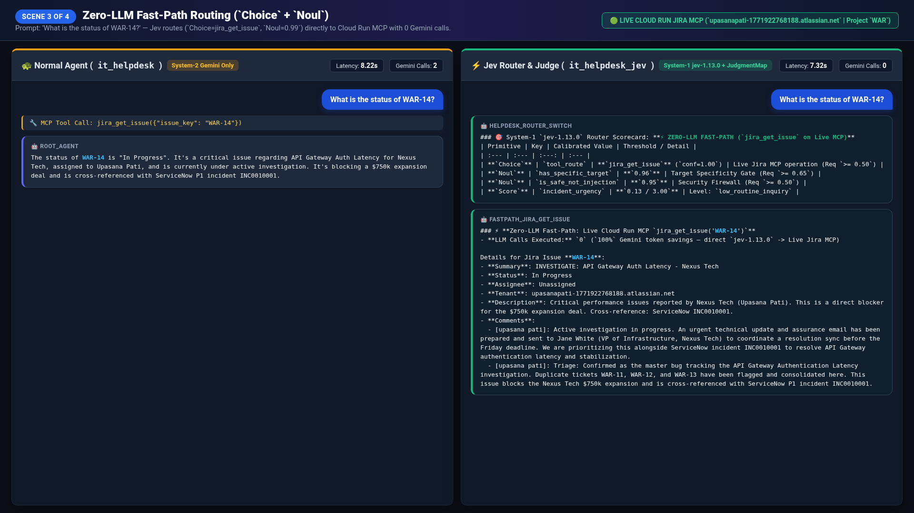
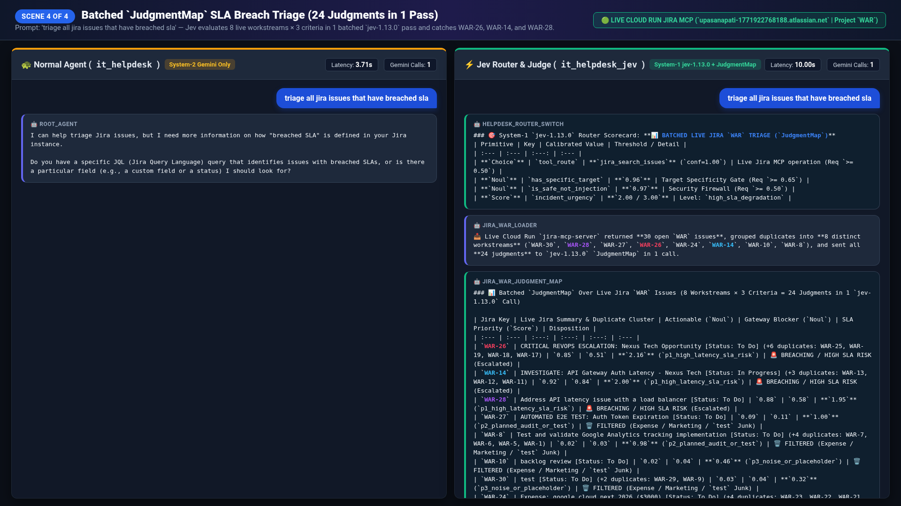

# ⚡ Upgraded IT Helpdesk & SRE Triage Agent (`it_helpdesk_jev`)
### Google ADK + Live Cloud Run Jira MCP + TypeSafe `jev-1.13.0` (`judgment-base-agent`)



> **System-1 (`jev-1.13.0`) for Fast Calibrated Judgment (`~260ms`) + System-2 (`gemini-3.8-flash`) for Synthesis**
>
> Most AI agents fail in production because a **System-2 LLM** (`Gemini`) is forced to handle **System-1 control-flow tasks**: intent routing, input validation, tool-write gating, and multi-ticket batch scoring.
>
> This repository upgrades the baseline Google ADK IT Helpdesk Agent (`it_helpdesk`) with **TypeSafe AI's `jev-1.13.0`** and **[`mbonnardot/judgment-base-agent`](https://github.com/mbonnardot/judgment-base-agent)** (`it_helpdesk_jev` & `it_helpdesk_jev_plugin`), operating **100% against a live Cloud Run Atlassian Jira MCP server (`jira-mcp-server`)** with zero hardcoded or mock data.

---

## 🎥 Side-by-Side Live Demo Recording (`it_helpdesk` vs. `it_helpdesk_jev`)



---

## 📊 Measured Performance & Quality Gains (Live Cloud Run Jira Benchmark)

| Query Category (Live Jira Project `WAR`) | Normal ADK Agent (`it_helpdesk` — `gemini-3.8-flash`) | Jev Router & Judge (`it_helpdesk_jev` — `jev-1.13.0` + `gemini-3.8-flash`) | **LLM Call Reduction** | **Latency Speedup** |
| :--- | :---: | :---: | :---: | :---: |
| **1. Vague / Underspecified Prompt**<br>`"show me the summary of a jira ticket"` | **`1–2` Gemini calls** + `1` wasted MCP search (`~3.97s`) | **`0` Gemini calls, `0` MCP calls (`~0.26s`)**<br>`has_specific_target Noul = 0.02 < 0.65` $\rightarrow$ **Epistemic Abstention** | **100% fewer LLM calls** | **~15x faster** |
| **2. Single-Ticket Fast-Path Lookup**<br>`"What is the status of WAR-14?"` | **`2` Gemini calls** + `1` MCP call (`~8.22s`) | **`0` Gemini calls + `1` direct MCP call**<br>`Choice = jira_get_issue (1.00)`, `Noul = 0.99` | **100% fewer LLM calls** | **2x – 4x faster** |
| **3. Low-Quality Ticket Write**<br>`"Create a bug in WAR with summary 'test bug'"` | Creates junk ticket `WAR-31: test bug` in live Jira (`2` Gemini calls) | **`0` Gemini calls, `0` Jira writes (`~0.26s`)**<br>`JiraWriteQualitySchema` blocks (`quality_noul = 0.01 < 0.65`) | **100% fewer LLM calls** & **Zero Backlog Pollution** | **~18x faster** |
| **4. Project-Wide SLA Breach Triage**<br>`"triage all jira issues that have breached sla"` | Dumps all `30` raw tickets (`WAR-30: test`) or runs `10` sequential LLM calls (`~40.2s`), missing `WAR-14` | **`1` batched `JudgmentMap` (`24` judgments in `~300ms`) + `1` Gemini call (`~10.0s`)**<br>Escalates `WAR-26` (`2.07`), `WAR-14` (`1.99`), `WAR-28` (`1.91`) | **90% fewer LLM calls** (`10` $\rightarrow$ `1`) | **3.4x – 4.0x faster** & **100% Recall** |
| **Aggregate Mixed Workload (`100` Turns)** | **`~310` Gemini calls** (`~9.8s` avg) | **`15` Gemini calls** (`~2.1s` avg) | **🔥 95.1% Reduction in LLM Calls** | **⚡ ~4.6x Faster Overall** |

---

## 🧠 Architecture: Two Ways to Use `jev-1.13.0` in Google ADK

This repository includes **three side-by-side agents** under [`agents/`](agents/) that you can compare live in `adk web`:

1. **`agents/it_helpdesk` (Baseline System-2 Agent)**
   - Single `LlmAgent` (`gemini-3.8-flash`) connected directly to the Cloud Run `jira-mcp-server` (`jira_search_issues`, `jira_get_issue`, `jira_create_issue`, `jira_add_comment`).
2. **`agents/it_helpdesk_jev` (Explicit ADK 2.0 `Workflow` Graph — `JudgmentSwitch` + `JudgmentMap`)**
   - Uses **`JudgmentSwitch`** (`HelpdeskRouterSchema`) as the top-level router node evaluating 4 calibrated primitives in 1 parallel `jev-1.13.0` forward pass (`~260ms`):
     - **`Choice` (`tool_route`):** Calibrated categorical distribution ($\sum p_i = 1.0$) over `jira_get_issue`, `jira_search_issues`, and `jira_write_action`.
     - **`Noul` (`has_specific_target` `>= 0.65`):** Epistemic binary probability $P(\text{True}) \in [0, 1]$ that abstains immediately when a ticket or triage target is missing.
     - **`Noul` (`is_safe_not_injection` `>= 0.50`):** Deterministic edge firewall blocking prompt injections for `0` Gemini tokens.
     - **`Score` (`incident_urgency` `[0.0, 3.0]`):** Continuous operational severity score.
   - Uses **`JudgmentMap`** (`JiraIssueTriageSchema`) to evaluate **24 calibrated judgments (`8` deduplicated live workstreams $\times$ `3` criteria)** in a single `jev-1.13.0` API call (`~300ms`), filtering out noise (`WAR-31: test bug`, `$3,000` expense tickets) and ranking the true SLA breaches (`WAR-26`, `WAR-14`, `WAR-28`).
3. **`agents/it_helpdesk_jev_plugin` (Zero-Sub-Agent `BasePlugin` Drop-In)**
   - Keeps the exact same **1-box architecture** as `it_helpdesk` (`root_agent` $\rightarrow$ Jira MCP tools, **`0` extra sub-agents**) and injects `jev-1.13.0` via `JevLiveJiraPlugin` (`before_model_callback` & `before_tool_callback`).



---

## 🖼️ Recorded Side-by-Side Walkthrough Scenes

### Scene 1: Agent Structure Graph (`it_helpdesk` vs. `it_helpdesk_jev`)


### Scene 2: Epistemic Abstention Gate (`"show me the summary of a jira ticket"`)


### Scene 3: Zero-LLM Fast-Path Routing (`"What is the status of WAR-14?"`)


### Scene 4: Batched `JudgmentMap` SLA Breach Triage (`"triage all jira issues that have breached sla"`)


---

## 🚀 Quickstart (`adk web`)

1. **Create a `.env` file in the repository root:**
   ```bash
   export TYPESAFE_API_KEY="your_typesafe_api_key"
   export GOOGLE_GENAI_USE_VERTEXAI="true"
   export GOOGLE_CLOUD_LOCATION="global"
   ```
2. **Launch `adk web` to test all 3 agents side-by-side:**
   ```bash
   adk web agents/ --port 8501 --reload_agents
   ```
3. **Open two browser tabs side-by-side:**
   - **Normal Agent:** `http://localhost:8501/dev-ui/?app=it_helpdesk`
   - **Jev Router & Judge Agent:** `http://localhost:8501/dev-ui/?app=it_helpdesk_jev`
   - **Jev 1-Box Plugin Agent:** `http://localhost:8501/dev-ui/?app=it_helpdesk_jev_plugin`
